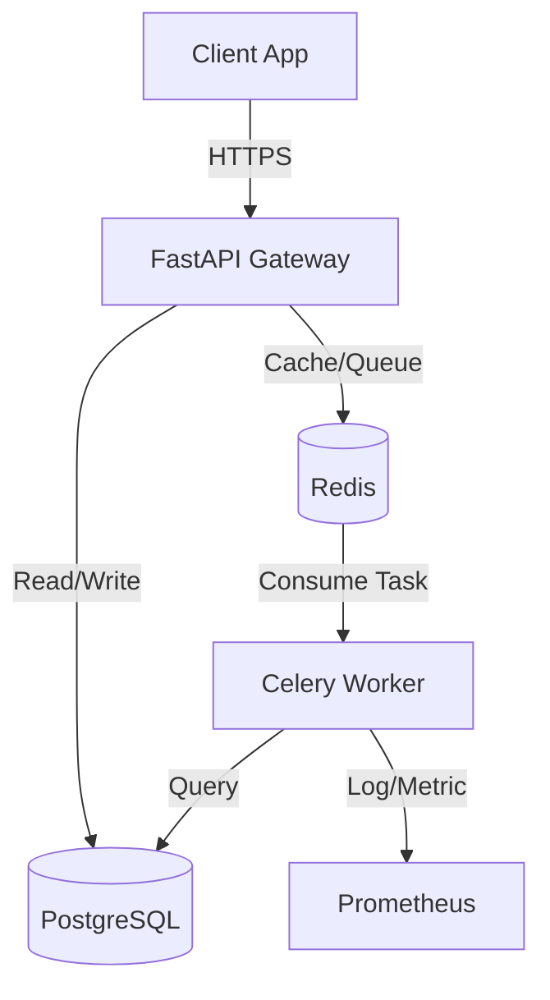

# 🤖 SupportFlow AI

[](https://www.python.org/downloads/)
[](https://fastapi.tiangolo.com/)
[](https://opensource.org/licenses/MIT)
[](https://www.docker.com/)

**SupportFlow AI** is a production-ready AI customer support agent designed to handle thousands of concurrent conversations with intelligent classification, contextual responses, and automatic escalation. Built with modern architecture (SO + TU + M patterns) to deliver reliable, enterprise-grade performance.

---


## 🎯 Key Features

- **🧠 Advanced AI**: Powered by OpenAI GPT-4o-mini & Groq for accurate classification and natural responses.
- **📚 RAG Knowledge Base**: Context-aware answers using dynamic retrieval from your documentation.
- **⚡ Async Architecture**: Scalable background processing with Celery, Redis, and PostgreSQL.
- **🛡️ Production Security**: JWT authentication, API keys, and rate limiting out of the box.
- **📊 Full Observability**: Integrated Prometheus metrics, Grafana dashboards, and structured logging.
- **🔄 Auto-Escalation**: Intelligent routing to human agents for complex queries.

## 🛠️ Tech Stack

**Backend**: Python 3.11, FastAPI, SQLAlchemy, Pydantic  
**AI/ML**: OpenAI (GPT-4o), Groq (Llama 3), LangChain Concepts  
**Infrastructure**: PostgreSQL 15, Redis 7, Celery, Docker Compose  
**Monitoring**: Prometheus, Grafana, Flower

## Response
You can read the full response here:
### ➡️ [View Response.](docs/responseTPG.md)


## 🚀 Quick Start

### Prerequisites
- Docker & Docker Compose
- API Keys (OpenAI or Groq)

### 1. Setup Environment
```bash
git clone https://github.com/aliarmaghan/supportFlow.AI.git
cd supportFlow.AI
cp .env.example .env
# Add your API keys to .env
```

### 2. Launch Application
We provide a helper script for easy management:

**PowerShell:**
```powershell
./scripts/dev.ps1 start
```

**Standard Docker:**
```bash
docker-compose up -d
docker-compose exec api alembic upgrade head
```

### 3. Access Services
- **API Documentation**: [http://localhost:8000/docs](http://localhost:8000/docs)
- **Celery Monitoring**: [http://localhost:5555](http://localhost:5555)
- **Redis UI**: [http://localhost:8081](http://localhost:8081)
- **PgAdmin**: [http://localhost:5050](http://localhost:5050)

## 📖 API Usage

All endpoints require API Key authentication: `Authorization: Bearer YOUR_API_KEY`

| Method | Endpoint | Description |
| :--- | :--- | :--- |
| `POST` | `/api/conversations/message` | Send a message to the AI agent (Sync) |
| `POST` | `/api/conversations/message/async` | Send a message for background processing |
| `GET` | `/api/conversations/{id}` | Retrieve conversation history and context |
| `GET` | `/health` | Check system status |

## 🏗️ Architecture



### Core Design Patterns
1. **Structured Output (SO)**: Type-safe responses for reliability.
2. **Tool Use (TU)**: Dynamic RAG capabilities.
3. **Memory (M)**: Persistent conversation history with smart caching.

## 📄 License & Contact

This project is licensed under the MIT License - see the [LICENSE](LICENSE) file for details.

**Created by [MD ALI ARMAGHAN](https://x.com/armaghan78)**  
📧 aliarmaghan78@gmail.com  
🔗 [Project Repository](https://github.com/aliarmaghan/supportFlow.AI.git)

---
*If you find this project helpful, please give it a star! ⭐*